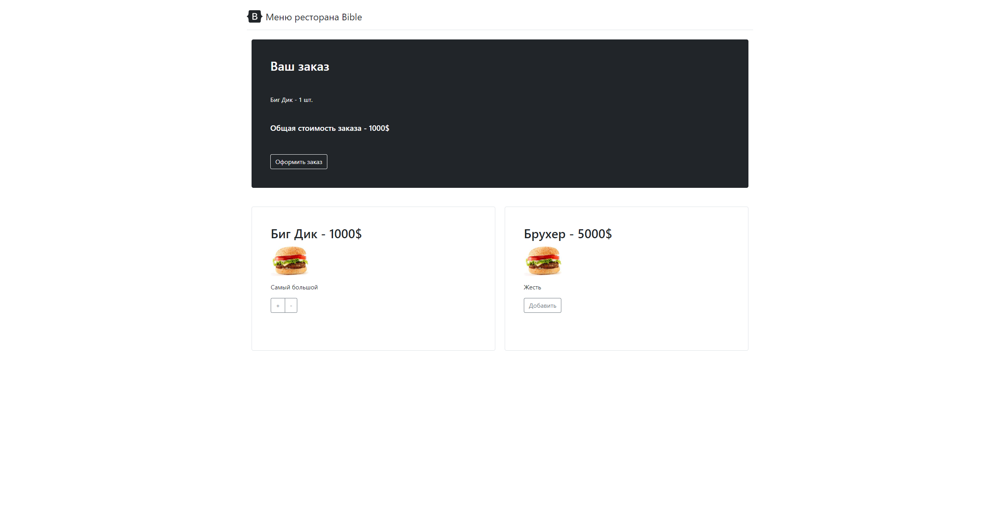

# Отчёт о курсовой работе
#### *По курсу "Основы Программирования"*
#### *Работу выполнил студент группы №3131 Тихомиров Н.А.*

## Изучение предметной области

Необходимо реализовать "Киоск заказа в ресторане. Система включает в себя интерфейсы для выбора блюд и получения номера очереди. Админский интерфейс позволяет редактировать каталог блюд.".

## Составление ТЗ

- Базовая система вывода списка блюд, их характеристик
- Базовая система добавления/редактирования блюд, их характеристик
- Возможность создания заказа с определенными позициями
- Подключение Yandex Maps API для вывода карты с "ближайшими ресторанами сети"

## Выбор технологий

#### *Платформа:*
Бесплатный хостинг **free.sprinthost.ru**. 

#### *Среда разработки:*
Sublime Text 3.

#### *Языки программирования:*
PHP, HTML.

## Реализация

### Пользовательский интерфейс:
- *Главное меню:*                                                                                           
  

- *Форма заказа с номером*                                                                                                        
  

### Пользовательский сценарий:

Пользователь заходит на сайт, сразу же попадает на главную страницу с меню *(user.php)*. Пользователь выбирает позиции, добавляя их в заказ, после оформления заказа пользователь попадает на страницу *(order.php)*, где он может увидеть номер своего заказа, сам заказ, а так же все рестораны сети в городе.

### API сервера:

При оформлении заказа пользователя используются **POST**-запросы c полями *user_id*, *dish_id*, *count*

При добавлении/удалении позиций в меню используются **GET**-запросы

### Хореография

**index.php**, при отсутствии переменной $_SESSION['user'], перенаправляет пользователя на страницу **auth.php**. Если переменная есть, то перенаправление не происходит. При нажатии на кнопку **Выйти** сервер отправляет запрос в **logout.php** *(в результате запроса перемения $_SESSION['user'])* будет уничтожена и направляет пользователя на **auth.php**.

Со страницы **auth.php**, при нажатии кнопки **"Регистрация"**, сервер отправляет запрос на **signup.php** *(тут данные будут проверены и, если всё ок, внесены в БД)*, передавая туда введённые в поля **"Логин"**, **Имя**, **Пароль** и **"Подтвердите пароль"** данные. **signup.php** после обработки данных возвращает  индикатор, в зависимости от значения которого будет выведено сообщение об ошибке или успешной регистрации.

При нажатии на странице **auth.php** кнопки **"Войти"**, сервер направит на **signin.php** запрос с введёнными данными. **signin.php** проверяет данные на корректность и возвращает индикатор, в зависимости от значения которого будет выведено сообщение об ошибке или пользователь получит переменную $_SESSION['user']) и будет перенаправлен на **index.php**.

Со страницы **auth.php**, при нажатии кнопки **"Войти через VK"**, перенаправляет пользователя на страницу **vk.php**. **vk.php** отправляет запрос на приложение VK и получает оттуда имя пользователя, а также создает переменную **$_SESSION['user'])**, и получает перенаправление на **index.php**.

При нажатии кнопки **"Отправить сообщение"** на странице **index.php** отправляется POST-запрос на создание новой заметки, результат которого будет выведен в ленту. 

### Структура базы данных

Браузерное приложение phpMyAdminДля используется для просмотра содержимого базы данных. Всего 3 таблицы:

Первая таблица для хранения данных о товарах:
1. "id" типа int с автоинкрементом для выдачи уникальных id всем товарам
2. "name" типа varchar для хранения названия товара
3. "description" типа varchar для хранения описания товара
4. "img" типа varchar для хранения пути к изображению

Вторая таблица для хранения данных о корзине пользователя:
1. "user_id" типа int для привязки позиций в заказе к id пользователя
1. "dish_id" типа int для определения блюда, которое пользователь добавил в заказ
1. "count" типа int сдля определения количества блюд

Третья таблица для хранения данных о заказе пользователя:
1. "id" типа int с автоинкрементом для выдачи уникальных id заказов всем пользователям
2. "orderprice" типа int для хранения даных о стоимости заказа

### Алгоритмы
1. Алгоритм оформления заказа                                                                                                                             

2. Алгоритм добавления товара                                                                         

### Значимые фрагменты кода
**Редакттирования данных заказа**:

    if(isset($_POST['Добавить']))
    {
        $id_dish = $_POST['Добавить'];
        $user_id = $_SESSION['user_id'];
        mysqli_query($connect, "INSERT INTO 'basket' ('user_id', 'dish_id', 'count') VALUES ('$user_id', '$id_dish', '1')");
    }

    if(isset($_POST['+']))
    {
        $id_dish = $_POST['+'];
        $user_id = $_SESSION['user_id'];
        mysqli_query($connect, "UPDATE 'basket' SET 'count' = 'count' + 1 WHERE 'user_id' = '$user_id' AND 'dish_id' = '$id_dish'");
    }

    if(isset($_POST['-']))
    {
        $id_dish = $_POST['-'];
        $user_id = $_SESSION['user_id'];
        mysqli_query($connect, "UPDATE 'basket' SET 'count' = 'count' - 1 WHERE 'user_id' = '$user_id' AND 'dish_id' = '$id_dish'");
    }
    

**Отображение данных заказа**:

    <h2>Ваш заказ</h2>
      
    <?php
    $user_id = $_SESSION['user_id'];
    $basket = mysqli_query($connect, "SELECT * FROM `basket` WHERE `user_id` = '$user_id'");
    $basket = mysqli_fetch_all($basket);
    $sum = 0;
    foreach ($basket as $baske)
    {
        $prod_id = $baske[1];
        $prod_data = mysqli_fetch_assoc(mysqli_query($connect, "SELECT * FROM `menulist` WHERE `id` = '$prod_id'"));
        $sum += $prod_data['price'] * $baske[2];
    ?>
    

        <?= $prod_data['name'] ?> - <?= $baske[2] ?> шт.
    

    <?php
    }
    ?>
    <?php
    $user_id = $_SESSION['user_id'];
    ?>
      
    

        <h5>Общая стоимость заказа - <?= $sum ?>$</h5>
    

      
    <form action='user_moves\order.php' method='POST'>
        <input type="hidden" name="num" value="<?= $basket ?>">
        <input type="hidden" name="name" value="<?= $prod_data ?>">
        <button class="btn btn-outline-light" name="Оформить заказ" type='submit' value="<?= $user_id ?>" width='50'>Оформить заказ</button>
    </form>

**Функция вывода сообщений**:

    function getComments($conn){
    $sql = "SELECT * FROM comments";
    $result = $conn->query($sql);
    $max_page_posts = 100;
    $last_post = mysqli_num_rows($result);
    $i = 0;
    while(($row = $result->fetch_assoc())){
        if (($last_post - $i) > $max_page_posts ){
        }
        else{
            echo "

";
            echo $row['uid']." ";
            echo $row['date']." ";
            echo $row['message']." ";
            $img_id = $row['image_id'];
            echo " ";
            if ($img_id) {
                echo "<td> </td>";
                }
            echo "
  <form method='POST' action='".likeSubmit($conn,$row)."'>  <button type='submit' name='".'like'.$row['cid']."' class='likeSubmit'>Like</button>  Likes: ".$row["likes"]."  </form>
";
            echo " ";
            echo "
  <form method='POST' action='".dislikeSubmit($conn,$row)."'>  <button type='submit' name='".'dislike'.$row['cid']."' class='dislikeSubmit' style='  background-color: #ff0000; color: white; border: none; cursor: pointer; opacity: 0.9;'>Dislike</button>  Dislikes: ".$row["dislikes"]."  </form>
";
            echo "
";
            echo "

";
        }
        $i++;
    }

Функция вывода карты:

    

## Поддержка
Не требуется. Логов нет, администрирование осуществляется через хостинг.
